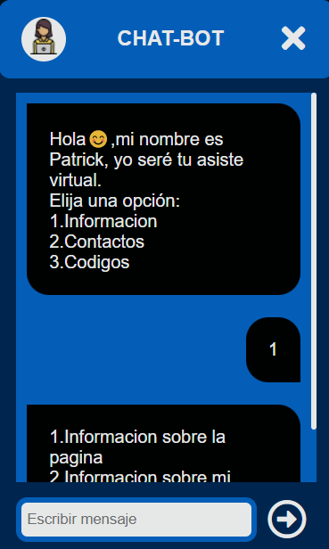

<h1>
    Portafolio Web V0.1
</h1>

    This was the first web portfolio I built from scratch with html-css and javascript.

  

<h1>
    ChatBot V0.1
</h1>

    This was my first chatbot made with javascript.
    

    

    <strong>
    It is not 100% complete.
    </strong>

